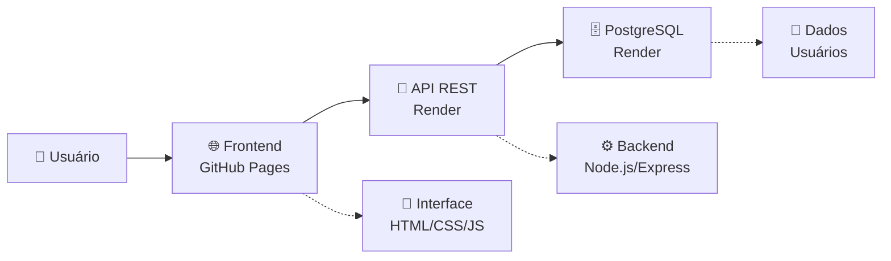

# 🎓 Sistema de Login e Registro - Projeto Educacional

<div align="center">


**Sistema completo de autenticação web desenvolvido para fins educacionais e demonstração de conceitos de desenvolvimento full-stack**

[🚀 Demo Live](https://joaopedrohenriquesb.github.io/Login-and-Register-System/) • [📚 Documentação Completa](./README_ESTUDOS.md) • [🔧 Guia de Deploy](./DEPLOY_RENDER.md)

</div>

---

## 🎯 **Sobre Este Projeto**

Este é um **projeto de estudos e demonstração** que implementa um sistema completo de login e registro web. Foi desenvolvido com **fins puramente educacionais** para demonstrar conceitos fundamentais do desenvolvimento web moderno.

### 🎓 **Objetivo Educacional**

Demonstrar na prática como construir uma aplicação web completa, abordando:

- ✅ **Frontend responsivo** com HTML, CSS e JavaScript vanilla
- ✅ **Backend robusto** com Node.js e Express.js
- ✅ **Autenticação segura** com hash de senhas (bcrypt)
- ✅ **Banco de dados** PostgreSQL (produção) e MySQL (desenvolvimento)
- ✅ **Deploy em produção** usando GitHub Pages + Render
- ✅ **API REST** para comunicação frontend/backend

---

## 🏗️ **Arquitetura Demonstrada**



### **Tecnologias Estudadas**

| Camada | Tecnologias | Propósito Educacional |
|--------|-------------|----------------------|
| **Frontend** | HTML5, CSS3, JavaScript ES6+ | Interface e experiência do usuário |
| **Backend** | Node.js, Express.js, bcrypt | Lógica de negócio e segurança |
| **Database** | PostgreSQL, MySQL | Persistência e consulta de dados |
| **Deploy** | GitHub Pages, Render | Hospedagem e produção |

---

## 🚀 **Funcionalidades Implementadas**

### 🔐 **Sistema de Autenticação**
- **Registro de usuários** com validação completa
- **Login seguro** com verificação de credenciais
- **Hash de senhas** usando bcrypt (salt rounds: 10)
- **Validação de dados** no frontend e backend

### 🎨 **Interface do Usuário**
- **Design responsivo** compatível com mobile
- **Transições suaves** entre formulários de login/registro
- **Feedback visual** em tempo real
- **Tratamento de erros** com mensagens claras

### 🔧 **API REST**
- **Endpoints organizados** (`/auth/login`, `/auth/register`)
- **Respostas padronizadas** em JSON
- **Códigos HTTP apropriados** (200, 400, 401, 500)
- **CORS configurado** para comunicação cross-origin

---

## 📚 **Como Usar Para Estudos**

### **1. Explorar o Código**
```bash
# Clonar repositório
git clone https://github.com/JoaoPedroHenriquesB/Login-and-Register-System.git
cd sistema-de-login

# Instalar dependências
npm install

# Executar localmente
npm start
```

### **2. Testar Funcionalidades**
- Abra `index.html` no navegador
- Teste registro de novos usuários
- Teste login com credenciais válidas/inválidas
- Observe o comportamento da API

### **3. Analisar Estrutura**
```
📁 Estrutura Educacional
├── 🌐 Frontend/          # Interface do usuário
│   ├── script.js         # Lógica JavaScript
│   └── style.css         # Estilos CSS
├── ⚙️ Backend/           # Servidor e API
│   ├── server.js         # Configuração Express
│   ├── Database/         # Configuração de banco
│   └── routes/           # Rotas da API
└── 📄 index.html         # Página principal
```

---

## 🎓 **Conceitos Demonstrados**

### **1. Segurança Básica**
```javascript
// Hash de senha antes de armazenar
const hashedPassword = bcrypt.hashSync(password, 10);

// Verificação de senha
const isValid = bcrypt.compareSync(password, user.password);
```

### **2. Comunicação Cliente-Servidor**
```javascript
// Requisição AJAX do frontend
const response = await fetch('/auth/login', {
    method: 'POST',
    headers: { 'Content-Type': 'application/json' },
    body: JSON.stringify({ username, password })
});
```

### **3. Configuração de Ambiente**
```javascript
// Detecção automática de ambiente
const isProduction = process.env.NODE_ENV === 'production';
const database = isProduction ? 'PostgreSQL' : 'MySQL';
```

---

## 🌐 **Deploy Demonstrado**

### **Frontend - GitHub Pages**
- ✅ Hospedagem gratuita de sites estáticos
- ✅ Deploy automático via Git
- ✅ HTTPS habilitado por padrão

### **Backend - Render**
- ✅ Hospedagem gratuita de Node.js
- ✅ Deploy automático via GitHub
- ✅ Variáveis de ambiente configuráveis

### **Database - PostgreSQL (Render)**
- ✅ Banco relacional em produção
- ✅ Backup automático
- ✅ SSL habilitado

---

## 📖 **Recursos de Aprendizado**

### **📚 Documentação Detalhada**
- [📖 README Completo](./README_ESTUDOS.md) - Explicação detalhada de todos os conceitos
- [🔧 Guia de Deploy](./DEPLOY_RENDER.md) - Passo a passo para hospedagem
- [🐛 Correção de Erros](./FIX_DATABASE_ERROR.md) - Troubleshooting comum

### **🎯 Próximos Passos de Estudo**
1. **JWT Tokens** - Autenticação mais robusta
2. **Middleware** - Proteção de rotas
3. **Testes Automatizados** - Jest, Mocha
4. **Frontend Frameworks** - React, Vue.js
5. **ORM** - Sequelize, Prisma

---

## ⚠️ **Importante: Fins Educacionais**

> **Este projeto foi desenvolvido para estudos e demonstração.** Para uso em produção real, implemente melhorias de segurança como JWT, rate limiting, validação robusta e testes automatizados.

### **Limitações Intencionais (Para Aprendizado)**
- Autenticação básica (sem JWT)
- Validações simples
- Sem rate limiting
- Logs básicos
- Sem testes automatizados

### **Para Produção Real, Adicione:**
- ✅ JWT ou sessões
- ✅ Rate limiting
- ✅ HTTPS obrigatório
- ✅ Logs estruturados
- ✅ Testes automatizados
- ✅ Validação robusta
- ✅ Recuperação de senha

---

## 🤝 **Contribuições Educacionais**

Contribuições que melhorem o valor educacional são bem-vindas!

### **Como Contribuir**
1. Fork o repositório
2. Crie uma branch para sua melhoria educacional
3. Adicione comentários explicativos
4. Documente os conceitos demonstrados
5. Abra um Pull Request

### **Ideias de Melhorias**
- [ ] Mais comentários explicativos no código
- [ ] Tutoriais passo a passo
- [ ] Exemplos de uso avançado
- [ ] Implementação de funcionalidades extras
- [ ] Melhorias na documentação

---

## 📊 **Estatísticas do Projeto**

| Métrica | Valor |
|---------|-------|
| **Linhas de Código** | ~500 linhas |
| **Arquivos** | 15+ arquivos organizados |
| **Tecnologias** | 10+ tecnologias demonstradas |
| **Conceitos** | 20+ conceitos de desenvolvimento |
| **Tempo de Estudo** | 20-30 horas de aprendizado |

---

## 👨‍💻 **Autor**

**João Pedro Henriques**
- 🐙 GitHub: [@JoaoPedroHenriquesB](https://github.com/JoaoPedroHenriquesB)
- 💼 LinkedIn: [Seu LinkedIn](https://linkedin.com/in/seu-perfil)
- 📧 Email: [Seu Email](mailto:seu-email@exemplo.com)

---

## 📄 **Licença**

Este projeto está sob a licença **ISC** e é **gratuito para uso educacional**.

```
Copyright (c) 2024 João Pedro Henriques

Permission to use, copy, modify, and/or distribute this software for 
educational purposes is hereby granted, free of charge.
```

---

<div align="center">

## 🎉 **Agradecimentos**

**Se este projeto ajudou nos seus estudos, deixe uma ⭐ no repositório!**

*Desenvolvido com 💙 para a comunidade de desenvolvedores em aprendizado*

---

**🎓 Bons estudos e happy coding! 🚀**

<<<<<<< HEAD
</div>
=======
</div>
>>>>>>> 38578eedcd8e7ecccfe0f09d5b1abd90e5a023f4
